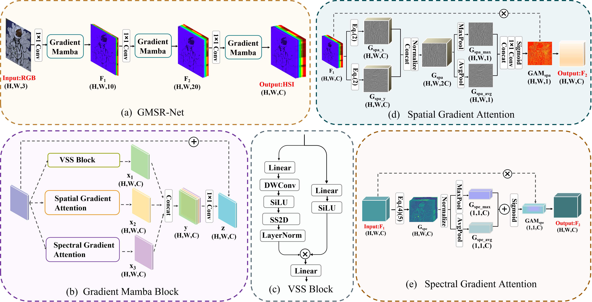

# GMSR: Gradient-Guided Mamba for Spectral Reconstruction from RGB Images
[Xinying Wang],  [Zhixiong Huang], [Sifan Zhang], [Jiawen Zhu], [Paolo Gamba], and [Lin Feng]


## GMSR-Net Framework



##  Spectral Reconstruction

We propose GMSR-Net, the first Mamba framework designed for SR task.  We are going to enlarge our model zoo in the future. The support list is as follows:

<details open>
<summary><b>Supported algorithms:</b></summary>

* [x] [RepCPSI](https://ieeexplore.ieee.org/abstract/document/10092801) (TGRS 2023)
* [x] [MST++](https://arxiv.org/abs/2111.07910) (CVPRW 2022)
* [x] [MST++](https://arxiv.org/abs/2111.07910) (CVPRW 2022)
* [x] [AGD-Net](https://ieeexplore.ieee.org/document/9599509) (TCI 2021)
* [x] [HSRNet](https://ieeexplore.ieee.org/document/9357488) (TNNLS 2020)
* [x] [HRNet](https://ieeexplore.ieee.org/document/9150643) (CVPRW 2020)
* [x] [MSCNN](https://link.springer.com/content/pdf/10.1007/978-3-030-03335-4_18.pdf) (PRCV 2018)
## Train
#### 1. **Created Environment.**

- anaconda NVIDIA GPU

- torch-1.9.0+cu111-cp37-cp37m-linux_x86_64

- torchvision-0.10.0+cu111-cp37-cp37m-linux_x86_64

- pip install causal_conv1d==1.0.0
- pip install mamba_ssm==1.0.1


#### 2. Data Preprocess.

Before training, you need to split the original datasets into 128*128 by train_data_preprocess and valid_data_preprocess. Then, replace the data location in the file. Finally, you can obtain the running data with:


# Getting the prepared train data by run:
python train_data_preprocess.py --data_path './data/Dataset' --patch_size 128 --stride 64 --train_data_path './dataset/2020Train'

# Getting the prepared valid data by run:
python valid_data_preprocess.py --data_path './data/Dataset' --valid_data_path './dataset/2020Val'
```
## Training.
```shell
python main.py
```
The data generated during training will be recorded in `/results/GMSR`.
## Test
```shell
python test.py
```
- Download the checkpoints ( [Baidu Disk](https://pan.baidu.com/s/1KTxgNsPgSQYHv6ZJkTstqg), code: `GMSR`))


## Citation
If you find this code helpful, please kindly cite:
```shell
# GMSR-Net
@article{wang2024gmsr,
  title={GMSR: Gradient-Guided Mamba for Spectral Reconstruction from RGB Images},
  author={Wang, Xinying and Huang, Zhixiong and Zhang, Sifan and Zhu, Jiawen and Feng, Lin},
  journal={arXiv preprint arXiv:2405.07777},
  year={2024}
}

```
